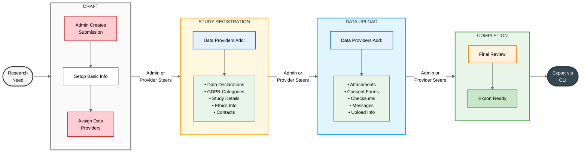

# Data Submission System (DSS)

The [Data Submission System \(DSS\)](https://datasubmission.lcsb.uni.lu/about) is an open-source collaborative platform designed to streamline the submission of biomedical data and associated information to your infrastructure.
It supports submitters, recipients, and data stewards through a guided multi-step workflow including metadata collection, file transfer, review and validation, communication, and completion.

The DSS is ideal for research organizations, biomedical facilities, and data stewards managing data transfers and facing challenges such as lack of provenance, incomplete metadata, and departmental misalignment. The platform supports internal submissions as well as submissions from external collaborators and institutions, ensuring that data and associated metadata are captured in a structured, traceable, and harmonised manner. By incorporating validation mechanisms, the tool helps ensure that data and metadata are complete, accurate, and consistent while streamlining the overall process of data transfer. This strengthens data quality while providing full tracking of data provenance.

The system is currently used by ELIXIR Luxembourg (ELIXIR-LU) for submissions under data sustainability services and by the Luxembourg Centre for Systems Biomedicine (LCSB) for general submissions in projects with restricted data access.

## Instances

Currently, the software runs as a [single instance at LCSB](https://datasubmission.lcsb.uni.lu/).

## Documentation

- Video tutorial: *(coming soon)*

## Acknowledgements

This work was supported by [ELIXIR Luxembourg](https://elixir-luxembourg.org).

## License

*(coming soon)*

## Quick Start

See the [Development Guide](docs/development/development.md) for setup and quick start instructions.

## Research Data Submission Process



## Manual Setup (Advanced)

Only needed if you want to customize the setup process. Otherwise, use `./setup_dev.sh` above.

### Requirements
- Python 3.12 or newer
- Node.js and npm
- OpenJDK 21+ (for some dependencies)
- **Optional:** [lftpythonclient](https://gitlab.com/uniluxembourg/lcsb/elixir/lft/lftpythonclient) - Required for LFT integration to generate upload links

### Python Environment Setup

```bash
# Using UV (recommended)
pip install uv
uv venv project_venv
source ./project_venv/bin/activate
uv pip install -e '.[dev]'
```

### Frontend Dependencies

```bash
cd elixir_dss/static/vendor
npm ci                    # Install exact versions from package-lock.json
npm run build:css         # Build SASS to CSS
cd ../../../
```

### Configuration

The setup script automatically creates `.env` file. For manual configuration:

**1. Create settings file:**
```bash
cp .env.template .env
```

**2. Database:** SQLite is configured by default (no setup needed)

**3. Authentication:**
- **CONFIG** (default): Local username/password auth - perfect for development
- **AAI**: ELIXIR OIDC authentication

**4. Secret Key:** For production, generate a secure key:
```python
import os
os.urandom(24)
```
        
### Database Initialization

The `./setup_dev.sh` script handles this automatically. For manual setup:

```bash
./manage.py init-db                                # Initialize DB with default data
./manage.py load-demo-users                        # Create demo users
./manage.py grant-data-steward-access <user_email> # Grant data-steward access to existing user
```

**Create additional admin users:**
```bash
./manage.py create-admin "First" "Last" "email@uni.lu" "elixir_id" "ELU_I_77"
```

### Database Migrations

The application uses Flask-Migrate (Alembic) for database schema changes.

```bash
# Create a new migration after model changes
flask db migrate -m "Description of changes"

# Apply migrations to database
flask db upgrade

# Rollback last migration
flask db downgrade
```


## Running the Application

Use `./run_dev.sh` or manually:

```bash
source ./project_venv/bin/activate
export FLASK_APP=elixir_dss
flask run --debug --port 5000
```

Application available at http://127.0.0.1:5000

**Export submissions:**
```bash
./manage.py export-submissions                    # Export completed
./manage.py export-submissions --all              # Export all
./manage.py export-submissions --submission-id 1  # Export specific
```

## Testing

Dependencies are installed by `./setup_dev.sh`. For manual testing:

```bash
# Run tests
uv run pytest
uv run pytest --cov=elixir_dss --cov-report=term-missing --cov-report=xml

# Lint and format
uvx ruff check .
uvx ruff format .

# Test across Python versions
uv run tox
```

## Code Quality

Run SonarQube analysis:

```bash
# Generate coverage report first
uv run pytest --cov=elixir_dss --cov-report=xml

# Run SonarQube scanner
sonar-scanner -Dsonar.token=<user-token>
```


## Versioning

bumpversion is used to handle versioning.

The semantic versioning format is used: {major}.{minor}.{patch}[-dev]

- **Patch**: Bug fixes only
- **Minor**: New features
- **Major**: Breaking changes

Update version:
```bash
bumpversion {patch,minor,major}
```

## Releasing

Create a release:
```bash
bumpversion release
```

This will:
- Change version from {major}.{minor}.{patch}-dev to {major}.{minor}.{patch}
- Create a commit and tag

Push the commit and tag to git after releasing.

## Deployment

**[Create Tag and GitHub Release](https://github.com/elixir-luxembourg/dss/releases/new)**

**Update Application on VM:**

```bash
# Deploy latest stable release (recommended)
sudo bash /home/elixirdss/app-src/elixir-dss/update_app.sh

# Or deploy a specific version
sudo bash /home/elixirdss/app-src/elixir-dss/update_app.sh v0.0.1
```

See `deploy/INSTRUCTIONS.md` for full deployment guide.

## Current Version

**v0.4.0-dev**


