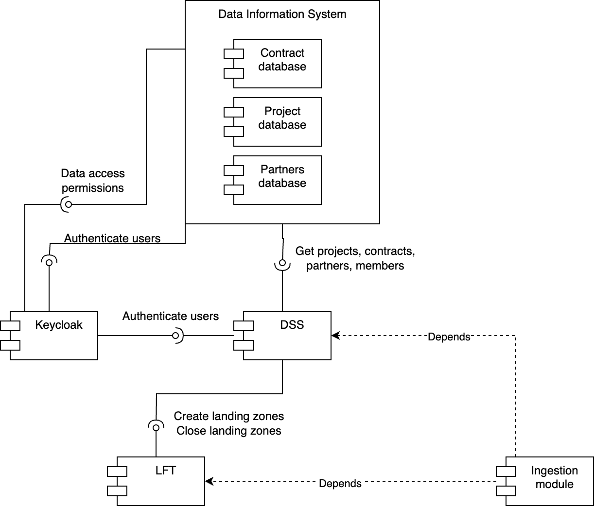
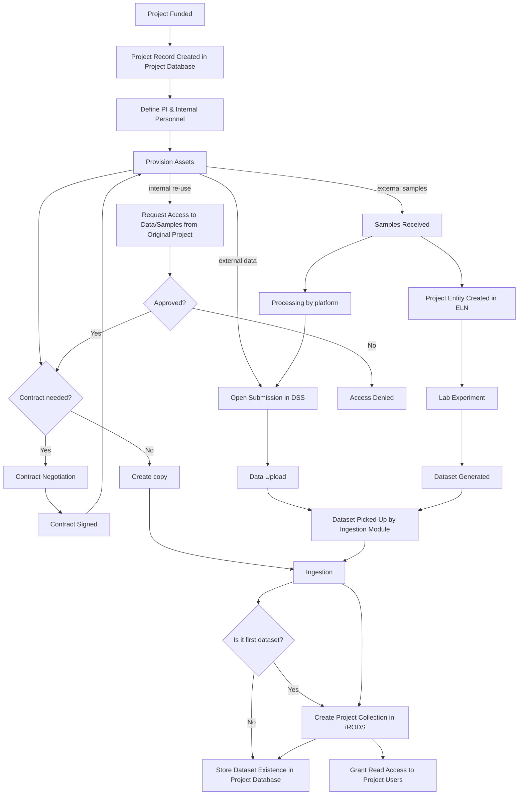

# External components

Following diagram shows external components and their relationship 

## Keycloak / OIDC 
- Authentication of users

## Data transfer tool
- The tool provides data upload links for each dataset registered in submission system.
- In our case LFT.
- Based on the size of the files, specific tool can be chosen...

## Insformation system

System providing list of existing active (running) projects.
The data gets ingested into the respective project space. 

This system can also provide:
- contracts under which submission is to happen
- membership/role of internal personnel in the project (e.g. data manager role) acting as recipients

### Database of partners
- either ROR.org
- or API call to the database of partners (can be the same system as the project database)

## ORCID
e.g. for selecting Authors of a dataset
This would require integration with Keycloak as well - even identities not coming from ORCID could have ORCID ID assigned.

## Arbitrary field integration (API)

This can be used for validation of metadata upon input. E.g. ontology lookup or any curated resource (ror.org, fairsharing.org, ...)

## Project flow diagram

