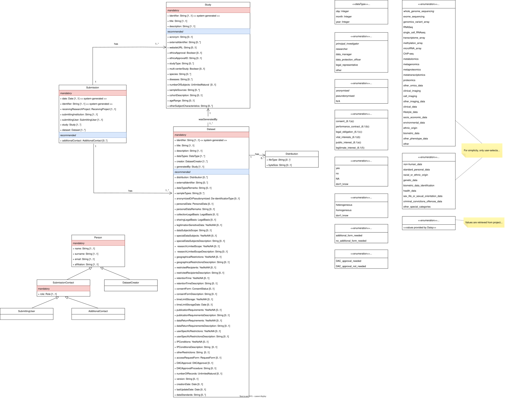

# Metadata Schema for the Data Submission System form

## Contents

## 1. Introduction

The data submission system (DSS) aims at allowing the submission of data to be used in projects from LCSB or for data hosting and reuse purposes under ELIXIR-Luxembourg (ELIXIR-LU), depending on the use case. Data can be submitted by personnel from LCSB, as well as from other institutions.

When a submission is initiated in the system, the submitter is required to provide metadata describing the data intended for submission. In this context, the purpose of this document is to present and explain the metadata schema that underpins the forms the basis of the DSS form design. 

**Kindly note that the metadata schema for the Data Submission System \(DSS\) is currently under active development and may be subject to further revisions and improvements.**

## 2. Overview

Figure 1 illustrates the UML class diagram that defines the metadata schema for the DSS form. This schema consists of five core classes \(Dataset,Distribution, Person, Submission, and Study\), along with four subclassess derived from class 'Person' \(DatasetCreator and SubmissionContact, with subclasses SubmittingUser and AdditionalContact\). In addition, it includes eleven supporting entities: one custom data type \(Date\) and ten enumerations \(ConsentStatus, DACApproval, DataType, De-identificationType, LegalBasis, PersonalData, ReceivingProject, RequestForm, Role, and YesNoNA\).

According to the metadata schema, a submission must always be linked to at least one study and one dataset, and may be linked to multiple studies and multiple datasets. However, each study and dataset can only be linked to a single submission. Furthermore, a dataset must always be linked to a study, as the study represents the origin of the data. Conversely, a dataset may be associated with zero or more distributions, each representing a physical expression of the dataset in a specific format.

Section 3 provides an overview of the main entities in the diagram, including the core classes and their subclasses. For each class, details about its properties are presented, such as name, definition, range, cardinality, usage notes, suggested controlled vocabularies (where applicable), and examples. While specific controlled vocabularies are recommended for some properties, alternative vocabularies are also acceptable. Section 4 describes includes the supporting entities (i.e., data types and enumerations). 

## 3. Main Entities

This section provides detailed descriptions of the core classes in the diagram, along with their properties.

### 3.1. Dataset

"Dataset" is a unit of data that originates from one study and has distinct characteristics in terms of  licensing, use restrictions and legal grounds of processing. A dataset is a unit for which an access request can be made. One dataset can contain multiple datatypes. There is no need to declare a new dataset (sheet) for each datatype, unless these datatypes will have different use restrictions or will be subject to access request applications individually.

#### 3.1.1. Mandatory Properties in Class 'Dataset'

| Property name | Definition | Range | Cardinality | Usage note | Suggested controlled vocabularies | Example |
|---------------|------------|-------|-------------|------------|--------------------------------------|---------|
|identifier           |Internal unique identifier for dataset            | String      | 1            |Unique dataset identifier generated by the system.            |            NA                          |  NA       |
|title              |Dataset title            |String       | 1            |  Provide a short descriptive title for the data.           |      NA                                | OncoDataset        |
|description               |Dataset description            |String       | 1            |   Provide a brief description of the dataset.         |        NA                              | *TBD*       |
|data types              |Data types included in the dataset            |  DataType (enumeration)     | 1..*            |   This property accepts one or more values from the enumeration 'DataType'.         |             NA                         | whole genome sequencing, proteomics, RNAseq        |
|creator               |Person(s) who contributed to the creation of the dataset            | DatasetCreator (class)     | 1..*            |  Values for this property are instances of class 'DatasetCreator' (a subcass of 'Person').          |            NA                          | NA        |
|generated by               |Study/Cohort that is the source of the data            | Study (class)    | 1            |   It is mandatory to link a dataset with one study, as the study is the source of the data. Thus, the value of this property is an instance of class 'Study'.          |        NA                              |  NA       |

#### 3.1.2. Recommended Properties in Class 'Dataset'

| Property name | Definition | Range | Cardinality | Usage note | Suggested controlled vocabularies | Example |
|---------------|------------|-------|-------------|------------|--------------------------------------|---------|
|distribution           | Physical representation of the Dataset in a particular format.           |  Distribution (class)    | 0..*            | Values for this property are instances of class 'Distribution'           |    NA                                  | NA        |
|external identifier              |External identifers/links, such as DOIs, accession numbers, or registry IDs            |String       |  0..*           |  Provide additional identifiers or links from external sources, if any.          |  NA                                    | EGAD00000000001        |
|data types remarks               |Remarks on data types included in the dataset            |  String     |  0..1           | In case of selecting "other" types of data in property 'data types', please describe those data types.           |          NA                            |  *TBD*       |
|sample types              |Types of samples analyzed            |   String    |     0..*        |  Controlled vocabularies are suggested in this property.          | UBERON, FMA                                      | blood, skin, tumor tissue         |
|anonymized or pseudonymized               |Is the data anonymised or pseudonymised?            |  De-identificationType (enumeration)     | 0..1            |  A dataset is considered anonymised if no stakeholder is holding a mapping from the Subject ID in the data to the identifying personal information e.g. name, surname, date of birth, address of the human subject supplying the data. A dataset is considered pseudonymised if there exists some cohort owner/coordinator holding the mapping from the Subject ID to the human subject identifying personal information.         |              NA                        | Anonymized        |
|personal data               |Categories and types of personal data included in the dataset, if applicable            |  PersonalData (enumeration)     | 0..*            | This property accepts one or more values from the enumeration 'PersonalData'. The definitions for these categories of data are sourced in the GDPR. In biomedical projects with pseudonymised cohort data, the options  would likely fall under  “Special category, i.e. sensitive, personal data” e.g. “Genetic data”, “Data concerning health” and "Other special categories of data”. 
You may get assistance from your institute’s DPO or legal team in filling out this section.           |       NA                               | Genetic data, Data concerning health        |
|personal data remarks               | Remarks on categories of personal data           | String      | 0..1            |  In case of selecting "other special categories of data", please provide a brief description.          |      NA                                |  *TBD*       |
|collection legal basis               | Legal basis according to Art. 6.1 GDPR for the collection of personal data           |       |  0..1           |            |                                      |         |
|sharing legal basis               |Legal basis according to Art. 6.1 GDPR for the sharing and, where applicable, the subsequent processing of personal data            |       |  0..1           |            |                                      |         |
|legitimation sensitive data               |For the processing of special category (sensitive) personal data, do you have a  legitimation under Art. 9.2 GDPR that provides specific derogation from the general prohibition to process such data?            |       |   0..1          |            |                                      |         |
|data subjects scope              |Scope of data subjects            | String      |   0..1          |            |                                      |         |
|special data subjects               | Does the dataset contain data from special subjects?           |       | 0..1            |            |                                      |         |
|special data subjects description              |Description of special data subjects            | String      | 0..1            |            |                                      | Children        |
|research limited scope           |Limited scope of research \(i.e., research/disease area\)            |       |  0..1           |            |                                      |         |
|research limited scope description           | Description of the research/disease areas restriction on data           | String      |  0..1           |            |                                      | Use only in Biomedical Research         |
|geographical restrictions           | Does consent contain clauses that put geographical restrictions to the sharing of data?           |       |  0..1           |            |                                      |         |
|geographical restrictions description           |Description of geographical restrictions on data            | String      |  0..1           |            |                                      | Not to be shared outside Country A, B, or EU/EEA        |
|restricted recipients           |Does the consent limit the type of recipients?             |       |  0..1           |            |                                      |         |
|restricted recipients description           |Description of the recipient restrictions on data            | String      |  0..1           |            |                                      | Data can be sent only to a specific type of institution such as private research institutions or public research institutions or to a named list of  institutions.        |
|retention time           | Does the consent contain clauses that put time-limits on the use of data?             |       |  0..1           |            |                                      |         |
|retention time description           |Description of the time-limit restrictions on data            | String      | 0..1            |            |                                      | 10 years from end of the project        |
|consent form          |Are the consents heterogeneous or homogeneous?            |       |  0..1           |            |                                      |         |
|consent form description         |If the consent is heterogeneous, please specify the data dictionary item (column) that specifies consent groups in data             | String      |   0..1          |            |                                      |         |
|time limit storage          |Is the data being sent to ELIXIR-LU/LCSB for a limited duration?            |       |  0..1           |            |                                      |         |
|time limit storage date          |Agreed end date or criteria for data's residence at ELIXIR-LU/LCSB            | Date      |   0..1          |            |                                      |  2030-04-25       |
|publication requirements          |Are there any requirements in case of publications based on the data?            |       | 0..1            |            |                                      | Papers should cite the cohort study.        |
|publication requirements description          |Description of publication requirements            | String       |  0..1           |            |                                      |         |
|data return requirements          |Is there a requirement to return data or documents to the database/resource?            |       |   0..1          |            |                                      |         |
|data return requirements description          |Description of the return requirements            | String      |   0..1          |            |                                      |         |
|user specific restrictions          |Is the use limited to approved users/groups/institutions?            |       |   0..1          |            |                                      |         |
|user specific restrictions description          |Specific users/groups/institutions to which ELIXIR-LU/LCSB is instructed to give access to the data upon request            |  String     |  0..1           |            |                                      |         |
|IP conditions          | Are there any conditions/restrictions regarding the Intellectual Property (IP) of the data?           |       | 0..1            |            |                                      |         |
|IP conditions description| Please describe the IP conditions/restrictions on the data, if any.           | String      | 0..1            |            |                                      |         |
|other restrictions         |Description of other restrictions on data            | String       |   0..1          |            |                                      |         |
|access request form          | Will all researchers accessing the data need to sign an access request form?           |       | 0..1            |            |                                      |         |
|DAC approval          |Will access require Data Access Committee (DAC) approval?            |       |             |            |                                      |         |
|DAC approval procedure          |Description the required procedure when a DAC approval is needed            | String      | 0..1           |            |                                      |         |
|number of records          |Number of records in the dataset            |   UnlimitedNatural    |   0..1          |            |                                      | 45        |
|version          | Dataset version            |  String     | 0..1            |            |                                      | v1.5        |
|creation date          |Creation date of the dataset            |  Date     |  0..1           |            |                                      | 2019-11-17        |
|last update date          | Last update date of the dataset           |  Date     |  0..1           |            |                                      | 2020-12-08        |
|data standards          | Specify the standard or guideline used for structuring or annotating the dataset           | String      |   0..*          |            |  EDAM, NCIt                                    | CDISC, MINSEQE        |

### 3.2. Distribution

"Distribution" refers to the physical representation of the Dataset in a particular format.

Class 'Distribution' does not contain any mandatory property. 

#### 3.2.1. Recommended Properties in Class 'Distribution'

| Property name | Definition | Range | Cardinality | Usage note | Suggested controlled vocabularies | Example |
|---------------|------------|-------|-------------|------------|--------------------------------------|---------|
|file type           |Type of file(s) included in the dataset          | String      | 0..*           |Format identifiers should be included, when applicable. If not provided, it will be obtained from the submitted dataset.            |                   EDAM, NCIt                   |  CSV (format:3752), FASTQ (format:1930), JSON, XML, TXT, BAM, VCF, etc.       |
|byte size           | Total size of the dataset          | String      | 0..1            |   Use appropriate units such as KB, MB, GB, or TB         |        NA                              | 2 GB       |

### 3.3. Person

"Person" represents an individual involved in the data creation and/or submission process. This is a parent class for 'DatasetCreator' and 'SubmissionContact'. 'SubmissionContact' acts as a parent class for subclasses 'SubmittingUser' and 'AdditionalContact'.

All properties belonging to class 'Person' are mandatory. 

**Note:** All subclasses inherit the properties of their respective parent classes.

#### 3.3.1. Mandatory Properties in Parent Class 'Study'

| Property name | Definition | Range | Cardinality | Usage note | Suggested controlled vocabularies | Example |
|---------------|------------|-------|-------------|------------|--------------------------------------|---------|
|name           |Person's name            | String      | 1            |            |          NA                           |  John       |
|surname           |Person's surname(s)            | String      | 1            |           |       NA                               |  Doe       |
|email           |Person's email address          | String      | 1            |          |                NA                      | John.Doe@email.com      |
|affiliation          |Institution to which the person is affiliated            | String      | 1            |           |        NA                              |  University of Luxembourg       |

#### 3.3.2. Subclass: 'DatasetCreator'

"DatasetCreator" represents the person(s) who contributed to the creation of the dataset. 

This subclass inherits all properties from class 'Person', with no additional properties required. 

#### 3.3.3. Subclass: 'SubmissionContact'

"SubmissionContact" represents the contact point(s) associated with the submission. 

This subclass inherits all properties from class 'Person', and has an additional mandatory property: 

| Property name | Definition | Range | Cardinality | Usage note | Suggested controlled vocabularies | Example |
|---------------|------------|-------|-------------|------------|--------------------------------------|---------|
|role           |Contact's role            | Role (enumeration)      | 1            |            |          NA                           |  Principal Investigator       |

'SubmissionContact' acts as a parent class for 'SubmittingUser' and 'AdditionalContact'. Both subclasses inherit all properties from class 'SubmissionContact', with no additional properties required.

### 3.4. Study

"Study" represents a scientific study spanning a certain period of time with designated Principal Investigators and supporting legal and ethical documentation. When submitting data from a large study with sub-studies keep in mind the following: if all sub-studies have the same properties; i.e. same PIs, same start/end dates and the same ethics approval, then they can be declared as a single study. The differences i.e. different sub-studies can be stated in dataset names.  

#### 3.4.1. Mandatory Properties in Class 'Study'

| Property name | Definition | Range | Cardinality | Usage note | Suggested controlled vocabularies | Example |
|---------------|------------|-------|-------------|------------|--------------------------------------|---------|
|identifier           |Internal unique identifier            | String      | 1            |Generated by the system            |                                      |  NA       |
|title              |Study title            |String       | 1            |            |                                      | Biomarker discovery and valdiation        |
|description               |Dataset description            |String       | 1            |            |                                      | CoolStudy attempts to address some seriously awesome stuff that will be very helpful        |

#### 3.4.2. Recommended Properties in Class 'Study'

| Property name | Definition | Range | Cardinality | Usage note | Suggested controlled vocabularies | Example |
|---------------|------------|-------|-------------|------------|--------------------------------------|---------|
|acronym           | Study acronym           | String      | 0..1            |            |                                      | CoolStudy       |
|external identifier           | External identifer(s) for the study          | String      | 0..*            |            |                                      | EGAS00000000009       |
|website's URL           | Study's website            | String      | 0..1            |            |                                      | https://www.coolstudy.cool       |
|ethics approval           | Confirmation that an ethics approval exists for the data collection as well as the data sharing for the purposes as foreseen in the agreement         | String      | 0..1            |            |                                      |        |
|ethics approval ID           | Identifier for the ethics/IRB approval document           | String      | 0..1            |            |                                      | X00.000       |
|study type          | Study type\(s\)           | String      | 0..1            |            |  EDAM, EFO, NCIt                                    | observational study \(NCIT:C16084\), drug discovery \(NCIT:C15802\)       |
|multi-center study           | Is it a multi-center study?            |       | 0..1            |            |                                      |       |
|species           | Species of origin of the samples/data          | String      | 0..*            |            |   NCBITaxon                                   | Homo sapiens       |
|diseases           | Disease of data subjects or the focus disease of the study           | String      | 0..*           |            |     MONDO | Crohn's disease, type II diabetes mellitus       |
|number of subjects           | Number of subjects/specimen           | UnlimitedNatural      | 0..1            |            |                                      | 524       |
|sample source          | Biological or material source\(s\) of the samples           | String      | 0..*            |            |     NCIt, EFO, UBERON                                 | tissue sample, cell line       |
|cohort description           | Description of cohorts           | String      | 0..1            |            |                                      | 250 patients \(132 male, 118 female\) with type II diabetes, 400 healthy controls \(174 male, 226 female\)       |
|age range           | Age range of subjects in the study           | String      | 0..1            |            |                                      | 18-99 years       |
|other subject characteristics           | Other subject characteristics           | String      | 0..*            |            |                                      | sex: 57 male / 85 female, diabetes status: 103 type II diabetes / 39 non-diabetic       |

### 3.5. Submission

"Submission" represents the process of submitting data to the system. It contains metadata describing that process. 

#### 3.5.1. Mandatory Properties in Class 'Submission'

| Property name | Definition | Range | Cardinality | Usage note | Suggested controlled vocabularies | Example |
|---------------|------------|-------|-------------|------------|--------------------------------------|---------|
|date           |Submission date            | Date      | 1            |Generated by the system            |                                      |  NA       |
|identifier              |Submission reference id            |String       | 1            |  Generated by the system           |                                      | NA        |
|receiving research project              |Receiving research project/service            |String       | 1            |  Information from project will be taken from Daisy          |                                      |         |
|submitting institution           | Submitting institution's name          |       | 1            |           |                                      |        |
|submitting user           | Submitting user          |       |             |           |                                      |        |
|study          |           |       |             |           |                                      |        |
|dataset          |          |       |             |           |                                      |        |

#### 3.5.2. Recommended Properties in Class 'Submission'

| Property name | Definition | Range | Cardinality | Usage note | Suggested controlled vocabularies | Example |
|---------------|------------|-------|-------------|------------|--------------------------------------|---------|
|additional contact           |           |      |           |            |                                      |       |

## 4. Supporting Entities

This section describes the enumerations and custom data types that support the core classes in the schema.

### 4.1. Data Type: 'Date'

**Description:** Represents a calendar date.

**Note:** All dates in the system must follow the format 'YYYY-MM-DD'.

**Properties:**

| Property Name | Type | Description |
|-----------------|----------|-----------------|
| day               | Integer   | Day of the month |
| month             | Integer   | Month of the year |
| year              | Integer   | Calendar year      |

### 4.2. Enumeration: 'ConsentStatus'

**Description:** This enumeration contains the values to specify whether the consent is heterogeneous or homogeneous. It is used as a value range for property 'consent status' in class 'Dataset'.

**Values:**
- Heterogeneous: If the consent form has changed throughout the course of the study in a way that changes the usage restrictions on data then this case is considered heterogeneous.
- Homogeneus: If the consent form has stayed the same over the course of the study but it has options so that different subjects can create different restrictions on their data, then this case is also considered heterogeneous.
- Don't_know

### 4.3. Enumeration: 'DACApproval'

**Description:** This enumeration contains the values to specify whether access to data will require DAC approval. It is used as a value range for property 'DAC approval' in class 'Dataset'.

**Values:**
- DAC_approval_needed
- DAC_approval_not_needed

### 4.4. Enumeration: 'DataType'

**Description:** This enumeration includes the possible values to indicate the data types included in the dataset. It is used as a value range for property 'data types' in class 'Dataset'.

**Note:** For simplicity, only user-selectable items are shown in the diagram. Umbrella categories for those items are omitted. The section below contains both umbrella (*in italics*) and user-selectable items in the list. 

**Values:**
- *Omics data*
    - *Genotype data*
        - Whole_genome_sequencing
        - Exome_sequencing
        - Genomics_variant_array
        - RNASeq
        - Single Cell RNAseq
    - *Genetic and derived genetic data*
        - Transcriptome_array
        - Methylation_array
        - MicroRNA_array
        - ChIP-seq
        - Metabolomics
        - Metagenomics
        - Metaproteomics
        - Metatranscriptomics
        - Proteomics
    - Other omics data
- *Imaging data*
    - Clinical imaging
    - Cell imaging
    - Other imaging data
- *Human subject data*
    - Clinical data
    - Lifestyle data
    - Socio Economic data
    - Environmental data
    - Ethnic origin
    - Biometric data
    - Other phenotype data
- Other

### 4.5. Enumeration: 'De-identificationType'

**Description:** This enumeration includes the possible values to indicate whether the data has been anonymized or pseudonymized, if applicable. It is used as a value range for property 'anonymized or pseudonimized' in class 'Dataset'.

**Values:**
- Anonymized: A dataset is considered anonymised if no stakeholder is holding a mapping from the Subject ID in the data to the identifying personal information e.g. name, surname, date of birth, address of the human subject supplying the data.
- Pseudonimized: A dataset is considered pseudonymised if there exists some cohort owner/coordinator holding the mapping from the Subject ID to the human subject identifying personal information.
- NA

### 4.6. Enumeration: 'LegalBasis'

**Description:** This enumeration includes the possible values to indicate to indicate the legal bases for the collection, sharing, and subsequent processing of personal data according to [Art.6.1 from the GDPR](https://gdpr-info.eu/art-6-gdpr/). It is used as a value range for property 'collection legal basis' and 'sharing legal basis' in class 'Dataset', respectively.

**Values:**
- Consent_(6.1(a))
- Performance_contract_(6.1(b)): Performance of a contract to which the data subject is party (6.1(b))
- Legal_obligation_(6.1(c)): Compliance with a legal obligation to which the controller is subject (6.1(c))
- Vital_interests_(6.1(d)): Protection the vital interests of the data subject (6.1(d))
- Public_interest_(6.1(e))
- Legitimate_interest_(6.1(f))

### 4.7. Enumeration: 'PersonalData'

**Description:** This enumeration includes the possible values to indicate the personal data types included in the dataset according to [Art. 9.1](https://gdpr-info.eu/art-9-gdpr/) and [Art. 10](https://gdpr-info.eu/art-10-gdpr/) from the GDPR, if applicable. It is used as a value range for property 'personal data' in class 'Dataset'.

**Note:** For simplicity, only user-selectable items are shown in the diagram. Umbrella categories for those items are omitted. The section below contains both umbrella (*in italics*) and user-selectable items in the list. 

**Values:**
- Non-human data
- Standard personal data
- *Special category, i.e. sensitive, personal data*
   - Racial or ethnic origin
   - Genetic data
   - Biometric data for the purpose of uniquely identifying a natural person
   - Data concerning health
   - Data concerning a natural person's sex life or sexual orientation
   - Data relating to criminal convictions and offences
   - Other special categories of data (e.g., molecular data that can give indication of a person's health)

### 4.8. Enumeration: 'ReceivingProject'

**Description:** This enumeration provides a list with the names of the projects of origin of both studies and datasets belonging to the studies. It is used as a value range for property 'receiving research project in class 'Submission'.

**Values:**
Values for projects are not shown in the diagram since the list of projects is retrieved from the [Data Information Syystem \(DAISY\)](https://github.com/elixir-luxembourg/daisy/) used at the LCSB and the ELIXIR-LU data hub. 

### 4.9. Enumeration: 'RequestForm'

**Description:** This enumeration includes the possible values to indicate whether all researchers accessing to data will need to sign an access request form. It is used as a value range for property 'access request form' in class 'Dataset'.

**Values:**
- Additional_form_needed 
- No_additional_form_needed

### 4.10. Enumeration: 'Role'

**Description:** This enumeration contains the values to specify the job role of the submission contacts in the system.

**Values:**
- Principal_Investigator
- Researcher
- Data_Manager
- Data_Protection_Officer
- Legal_Representative
- Other

### 4.11. Enumeration: 'YesNoNA'

**Description:** This enumeration includes the possible values for Yes/No questions. Additional values such as 'not applicable' and 'don't know' are also allowed. 

**Values:**
- Yes
- No
- NA: Not applicable
- Don't_know
