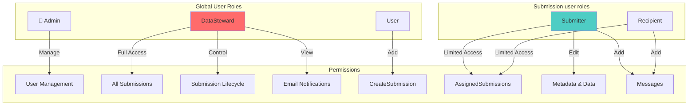
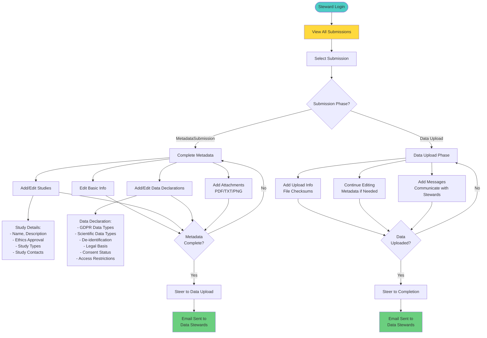
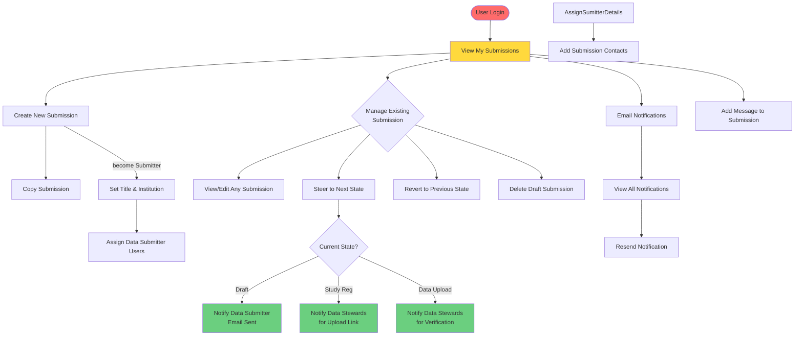

 two primary user roles:

## Global roles
- **Admin**: power user managing user and config
- **Data Steward**: Create and manages submissions, and oversees the entire submission process
- **User**: Can create submissions and become Submitter. Can be also added as recipient.

## Submission context roles
User roles assinged within the scope of the submission.
- **Submitter**:  Submitter is defined in the draft stage by user creating the submission.

If regular user creates a submission, it has to be Submitter. Otherwise, the submission cannot be steered further.

## User Roles and Permissions

## Submitter Workflow

### DataSteward Capabilities Summary

**Submission Management:**

## Data Steward Workflow

Data steward can do what normal users can do and even become submitter.
On top of that, its reponsible for steering submission from Approval -> Data upload

| Permission / Action                        | Admin | Data Steward | Submitter | Recipient |
|--------------------------------------------|:-----:|:------------:|:---------:|:---------:|
| View all users                             |  ✅   |      ❌      |    ❌     |    ❌     |
| Edit user info/roles                       |  ✅   |      ❌      |    ❌     |    ❌     |
| Assign/modify global roles                 |  ✅   |      ❌      |    ❌     |    ❌     |
| View all submissions                       |  ✅   |      ✅      |    ❌     |    ❌     |
| View assigned submissions                  |  ❌   |      ✅      |    ✅     |    ✅     |
| Create submission                          |  ❌   |      ✅      |    ✅      |   ✅      |
| Edit submission (Draft/MetadataSubmission) |  ❌   |      ✅      |    ✅     |    ❌     |
| Delete submission (Draft only)             |  ❌   |      ✅      |    ✅     |    ❌     |
| Steer submission forward                   |  ❌   |      ✅      |   from Draft and MetadataSubmission     |    ❌     |
| Revert submission to previous state        |  ❌   |      ✅      |    ❌     |    ❌     |
| Assign recipient to submission.            |  ❌   |      ✅      |    ✅     |    ❌     |
| Add/edit/delete metadata                   |  ❌   |      Draft, MetadataSubmission      |   Draft,MetadataSubmission     |    ❌     |
| Add/delete attachments                     |  ❌   |      ✅      |    Draft,MetadataSubmission     |    ❌     |
| Add/edit/delete upload info                |  ❌   |      Data Upload      |    Data Upload     |    ❌     |
| Add messages                               |  ❌   |      ✅      |    ✅     |    ✅     |
| View notifications                         |  ✅   |      ✅      |    ❌     |    ❌     |
| Resend notifications                       |  ✅   |      ✅      |    ❌     |    ❌     |

 ✅ Any user can create a submission - become submitter.

### File Upload Constraints

- **Allowed file types**: PDF, TXT, PNG
- **File size**: Controlled by server configuration
- **Storage**: Files stored in `UPLOAD_FOLDER` with UUID-based folder names
