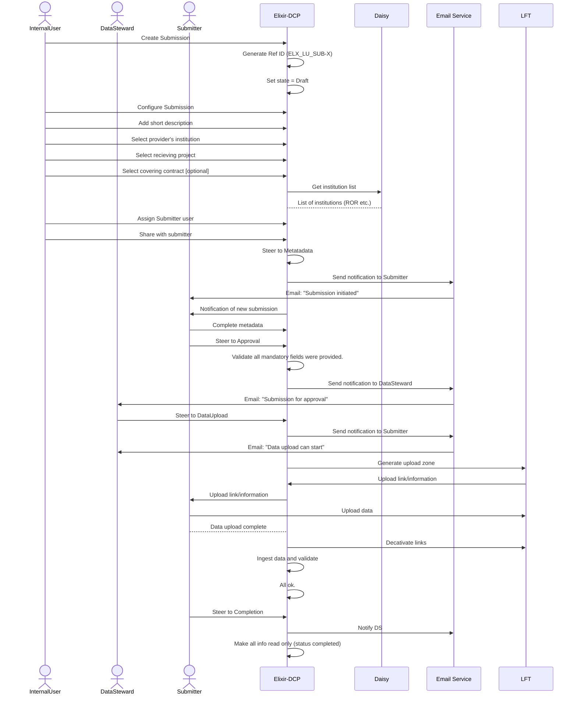
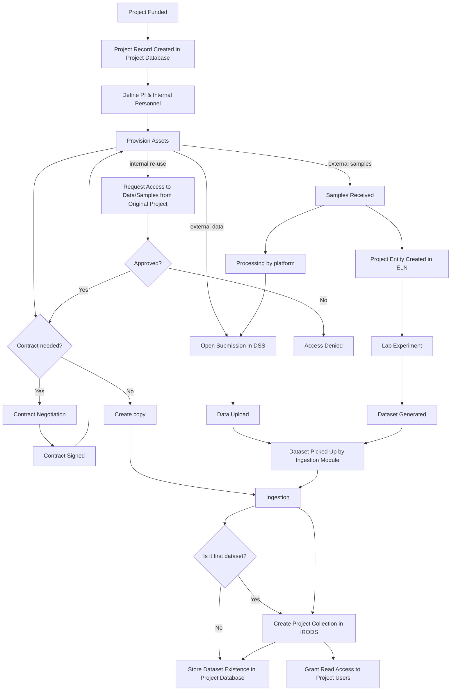

# Complete submission process

```mermaid
sequenceDiagram
    actor iU as InternalUser
    actor DS as DataSteward
    actor Submitter
    participant System as Elixir-DCP
    participant Daisy
    participant Email as Email Service
    participant LFT

    iU->>System: Create Submission
    System->>System: Generate Ref ID (ELX_LU_SUB-X)
    System->>System: Set state = Draft

    iU->>System: Configure Submission
    iU->>System: Add short description
    iU->> System: Select provider's institution
    iU->> System: Select recieving project
    iU->> System: Select covering contract [optional]
  
    System->> Daisy: Get institution list
    Daisy-->System: List of institutions (ROR etc.)
    iU->>System: Assign Submitter user
    iU->> System: Share with submitter
    System ->> System: Steer to Metatadata
    System->>Email: Send notification to Submitter
    Email->>Submitter: Email: "Submission initiated"
    System->>Submitter: Notification of new submission


    Submitter->>System: Complete metadata
    Submitter->>System: Steer to Approval
    System->>System: Validate all mandatory fields were provided.
    System->>Email: Send notification to DataSteward
    Email->>DS: Email: "Submission for approval"

    DS->>System: Steer to DataUpload
    System->>Email: Send notification to Submitter
    Email->>DS: Email: "Data upload can start"
    System->>LFT: Generate upload zone
    LFT->>System: Upload link/information
    System->>Submitter: Upload link/information

    Submitter->>LFT: Upload data
    Submitter-->System: Data upload complete
    System->>LFT: Decativate links
    System->>System: Ingest data and validate
    System->>System: All ok.
 
    Submitter->>System: Steer to Completion
    System->>Email: Notify DS
    System->>System: Make all info read only (status completed)

```

## Project flow diagram

```mermaid
flowchart TD
    A[Project Funded] --> B[Project Record Created in Project Database]
    B --> C[Define PI & Internal Personnel]
    C --> R
    R --> T{Contract needed?}
    T -- No --> V[Create copy]
    V --> K
    T -- Yes --> D[Contract Negotiation]
    D --> E[Contract Signed]
    E --> R
    R[Provision Assets] -- external data --> F[Open Submission in DSS]
    F --> G[Data Upload]
    K --> H1{Is it first dataset?}
    H1 -- Yes --> H[Create Project Collection in iRODS]
    H1 -- No --> J
    H --> I[Grant Read Access to Project Users]
    H --> J[Store Dataset Existence in Project Database]
    G --> P
    K[Ingestion] --> H

    %% Samples received by post
    R -- external samples --> L
    L[Samples Received] --> M[Project Entity Created in ELN]
    M --> N[Lab Experiment]
    N --> O[Dataset Generated]
    O --> P[Dataset Picked Up by Ingestion Module]
    P --> K

    %% Data re-used from other projectß
    R -- internal re-use --> Q
    Q[Request Access to Data/Samples from Original Project] --> S{Approved?}
    S -- Yes --> T
    S -- No --> U[Access Denied]

    %% Data from platforms
    L --> W
    W[Processing by platform] --> F
```