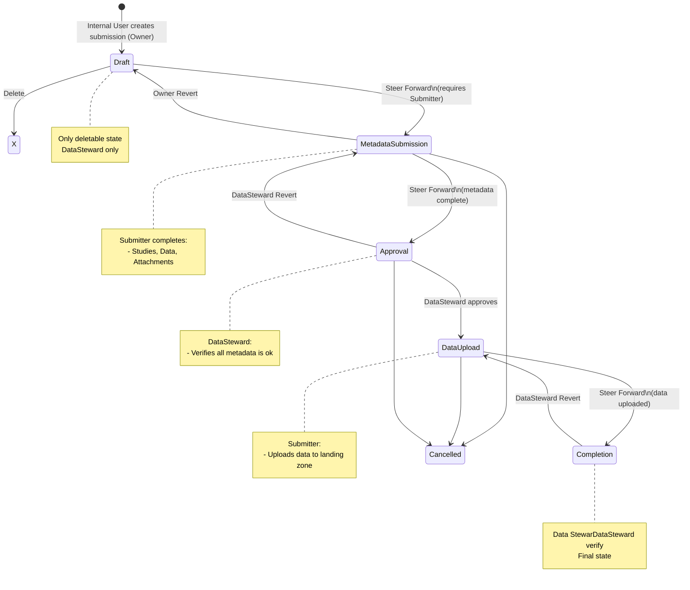

## Submission Lifecycle

### State Flow Diagram

### State Details

| State                  | Label                | Description                       | Visible To                                 | Editable metadata         |
|------------------------|---------------------|-----------------------------------|--------------------------------------------|--------------------------|
| `Draft`                | Draft               | Initial state, submission setup   | Data Steward, Submitter (owner)            | Data Steward, Submitter (owner)        |
| `MetadataSubmission` | MetadataSubmission  | Metadata collection phase         | Data Steward, Submitter, Recipient         | Data Steward, Submitter  |
| `Approval` | Approval            | Approval of metadata              | Data Steward, Submitter, Recipient         | Data Steward             |
| `DataUpload`     | Data Upload         | Data upload phase                 | Data Steward, Submitter, Recipient         | Submitter (only upload status)  |
| `Completion`            | Completion          | Final verification phase          | Data Steward, Submitter, Recipient         | No                       |
| `Cancelled` | Cancelled | Final phase when things go wrong | Visible to Data Steward, Submitter, Recipient | No |

## Workflow Rules & Constraints

### State Transition Rules

1. **Draft → MetadataSubmission**
   - ✅ Requires: At least one submitter and one recipient assigned, receiving project selected.
   - ✅ Who can trigger: Owning user only
   - 📧 Notification: Sent to submitter and recipient

2. **MetadataSubmission → Approval**
   - ✅ Requires: Metadata should be complete (recommended, not enforced)
   - ✅ Who can trigger: Submitter
   - 📧 Notification: Sent to data stewards
   - 📅 Records `finalised_on` date

3. **Approval -> DataUpload**
    - Requires: Validation by DataSteward
    - Who can trigger: DataSteward
    - Notification: Sent to submitter
    - Records `metadata_approved_on` date

4. **Data Upload → Completion**
   - ✅ Requires: Data uploaded (verified externally)
   - ✅ Who can trigger: DataSteward or Recipient
   - 📧 Notification: Sent to data stewards

5. **Any phase -> Cancelled**
   - Requires: Cancellation message
   - Who can trigger: DataSteward
   - Notification: Submitter, Recipient
   
6. **Revert (Any State → Previous State)**
   - ✅ Who can trigger: DataSteward only
   - ❌ Cannot revert from Draft (no previous state)
   - Notification: Sent to Submitter, Recipient

### Deletion Rules

- ✅ Can delete: Submissions in Draft state only
- ❌ Cannot delete: Any submission that has progressed beyond Draft
- ✅ Who can delete: Submitter or DataSteward
- Notification: none

## Activity diagrams for each state

### draft
- select recieving project
- select recieving person (it has to be member of the project)
- [select metadata tier - gold, silver, bronz - based on guidance]
- agreement (under the project) can be selected
- select submitting institution (in case the contract is selected, in principle only signatories of the agreement should be in the list)
- steer to metadata filling 

### metadata submission
Owner lane:
- share submission with submitter - add submitter (if it exists in KC, add that user, if it does not, provide only email address)

Submitter lane:
- fill in contacts
    - note: there must be certain contact points prefilled (PI, DPO, legal representative, ...)?
- create study
    - populate study form
    - back loop in case there are multiple studies
- create dataset
    - link it to study
    - name, authors + metadata based on model
- steer to approval
    - automatic validation (0 datasets, 0 studies, missing contact points, ...)
    - pop-up "I acknowledge all information I have provided is correct and I can be held liable for any non-compliance resulting from wrong or incomplete metadata."

### approval
- notify data steward
- datasteward reviews all metadata
- data steward reviews all documents and selects an agreement (note: by now it should be recorded in DAISY)

### Data Upload
- Submitter is notified the upload is possible
Submitter lane: 
- navigate to datasets of the submission
- click on upload button next to the dataset
- Message: "you will be redirected to data upload tool", once the upload is over, confirm here (showing icon or "I am done" sign.)
- redirect to data upload tool
- upload data
- go back to submission poratl