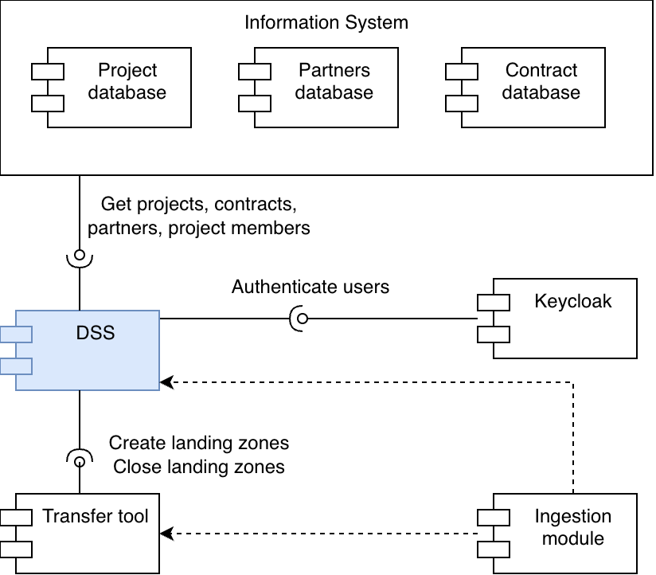

# Integrations

Following diagram shows other systems DSS depend on or can be integrated with

## Keycloak / OIDC 
- Authentication of users

## Data transfer tool

- The tool provides data upload links for each dataset registered in submission system.
- Currently its LCSB File Transfer tool powered by IBM Aspera
- In future, based on e.g. the size of the files, specific tool can be selected.

## Information system

System containing ground truth on external assets. Currently this module provides projects and list of internal users eligible to get recipient role.

This system can also provide:
- contracts under which submission is to happen
- membership/role of internal personnel in the project (e.g. data manager role) acting as recipients

### Database of partners

- either ROR.org or local infromation system
- or API call to the database of partners (can be the same system as the project database)

!!! warning
    Following integrations are not implemented

## Arbitrary field integration (API)

The forms This can be used for validation of metadata upon input. E.g. ontology lookup or any curated resource (ror.org, fairsharing.org, ...)

## Ingestion module

Module with access to data landing zone responsible for its ingestion into final project location. This module is rather independent of data submission system.
The module queries DSS API for information if needed.

In future, it could also give "feedback" on the insgestion, e.g. in case the ingestion fails or there is a report compiled.

## ORCID
e.g. for selecting Authors of a dataset
This would require integration with Keycloak as well - even identities not coming from ORCID could have ORCID ID assigned.