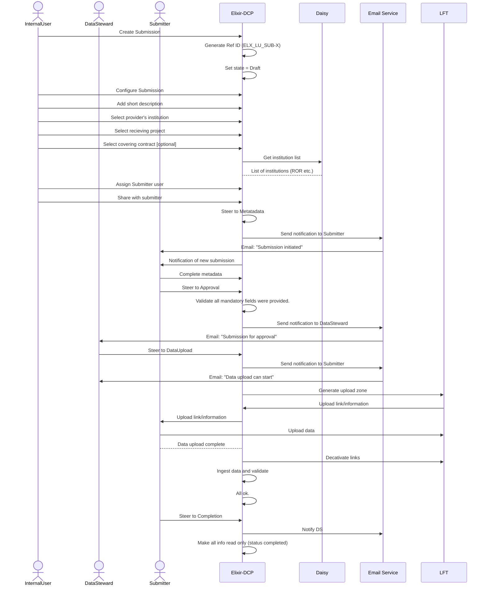

# Complete submission process

```mermaid
sequenceDiagram
    actor iU as InternalUser
    actor DS as DataSteward
    actor Submitter
    participant System as Elixir-DCP
    participant Daisy
    participant Email as Email Service
    participant LFT

    iU->>System: Create Submission
    System->>System: Generate Ref ID (ELX_LU_SUB-X)
    System->>System: Set state = Draft

    iU->>System: Configure Submission
    iU->>System: Add short description
    iU->> System: Select provider's institution
    iU->> System: Select recieving project
    iU->> System: Select covering contract [optional]
  
    System->> Daisy: Get institution list
    Daisy-->System: List of institutions (ROR etc.)
    iU->>System: Assign Submitter user
    iU->> System: Share with submitter
    System ->> System: Steer to Metatadata
    System->>Email: Send notification to Submitter
    Email->>Submitter: Email: "Submission initiated"
    System->>Submitter: Notification of new submission


    Submitter->>System: Complete metadata
    Submitter->>System: Steer to Approval
    System->>System: Validate all mandatory fields were provided.
    System->>Email: Send notification to DataSteward
    Email->>DS: Email: "Submission for approval"

    DS->>System: Steer to DataUpload
    System->>Email: Send notification to Submitter
    Email->>DS: Email: "Data upload can start"
    System->>LFT: Generate upload zone
    LFT->>System: Upload link/information
    System->>Submitter: Upload link/information

    Submitter->>LFT: Upload data
    Submitter-->System: Data upload complete
    System->>LFT: Decativate links
    System->>System: Ingest data and validate
    System->>System: All ok.
 
    Submitter->>System: Steer to Completion
    System->>Email: Notify DS
    System->>System: Make all info read only (status completed)

```
