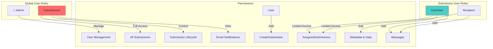
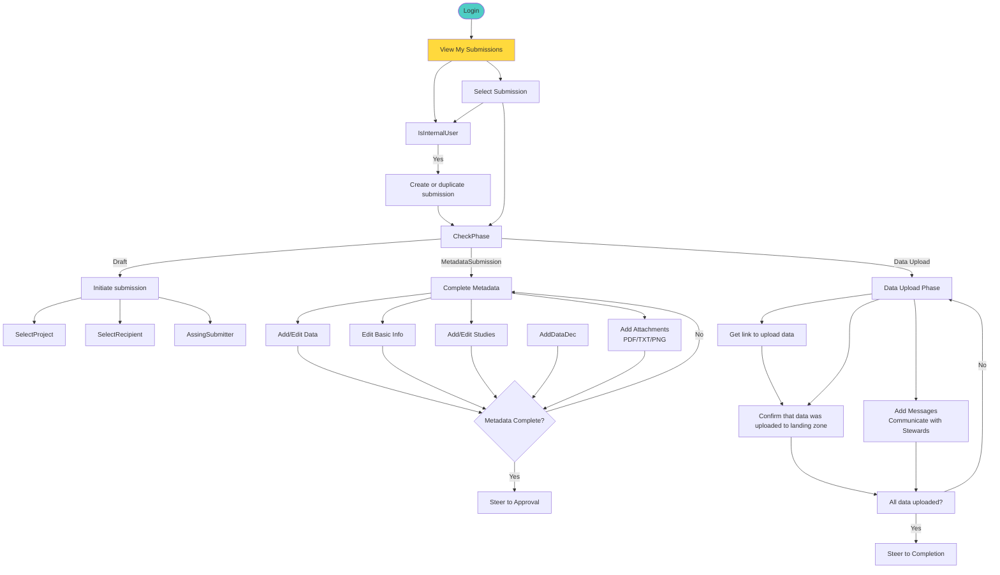

There are two primary groups of roles in the system based on the context in which they are defined.

## Global roles
- **Admin**: power user managing user and config
- **Data Steward**: Create and manages submissions, and oversees the entire submission process
- **User**: Can create submissions and become Submitter. Can be also added as recipient.

## Submission roles
User roles assinged within the scope of the submission.
- **Submitter**:  Submitter is defined in the draft stage by user creating the submission.
- **Recipient**: Person recieving data on our side. It can be same user as submitter. The recipient must be defined as project member.

If regular user creates a submission, they get submitter role.

## User Roles and Permissions

## Submitter Workflow

Submitter is define in scope of a submission so the workflow starts after Draft phase.

## Data Steward Workflow

Data steward either initiates submission or/and approves all submissions before dataUpload phase

Data steward can do what normal users can do and even become submitter.
On top of that, its reponsible for steering submission from Approval -> Data upload

## Permissions

 ✅ Any internal user can create a submission and also become submitter.

| Permission / Action                        | Admin | Data Steward | Submitter | Recipient |
|--------------------------------------------|:-----:|:------------:|:---------:|:---------:|
| View all users                             |  ✅   |      ❌      |    ❌     |    ❌     |
| Edit user info/roles                       |  ✅   |      ❌      |    ❌     |    ❌     |
| Assign/modify global roles                 |  ✅   |      ❌      |    ❌     |    ❌     |
| View all submissions                       |  ✅   |      ✅      |    ❌     |    ❌     |
| View assigned submissions                  |  ❌   |      ✅      |    ✅     |    ✅     |
| Create submission (including "Create copy")|  ❌   |      ✅      |    ✅      |   ✅     |
| Edit submission (Draft/MetadataSubmission) |  ❌   |      ✅      |    ✅     |    ❌     |
| Export submission as PDF / JSON            | ❌    |      ✅      |    ✅.    |    ✅.    |
| Delete submission (Draft only)             |  ❌   |      ✅      |    ✅     |    ❌     |
| Steer submission forward                   |  ❌   |      ✅      |   from Draft and MetadataSubmission     |    ❌     |
| Revert submission to previous state        |  ❌   |      ✅      |    ❌     |    ❌     |
| Assign recipient to submission.            |  ❌   |      ✅      |    ✅     |    ❌     |
| Add/edit/delete metadata                   |  ❌   |      Draft, MetadataSubmission      |   Draft,MetadataSubmission     |    ❌     |
| Add/delete attachments                     |  ❌   |      ✅      |    Draft,MetadataSubmission     |    ❌     |
| Add/edit/delete upload info                |  ❌   |      Data Upload      |    Data Upload     |    ❌     |
| Add messages                               |  ❌   |      ✅      |    ✅     |    ✅     |
| View notifications                         |  ✅   |      ✅      |    ❌     |    ❌     |
| Resend notifications                       |  ✅   |      ✅      |    ❌     |    ❌     |
