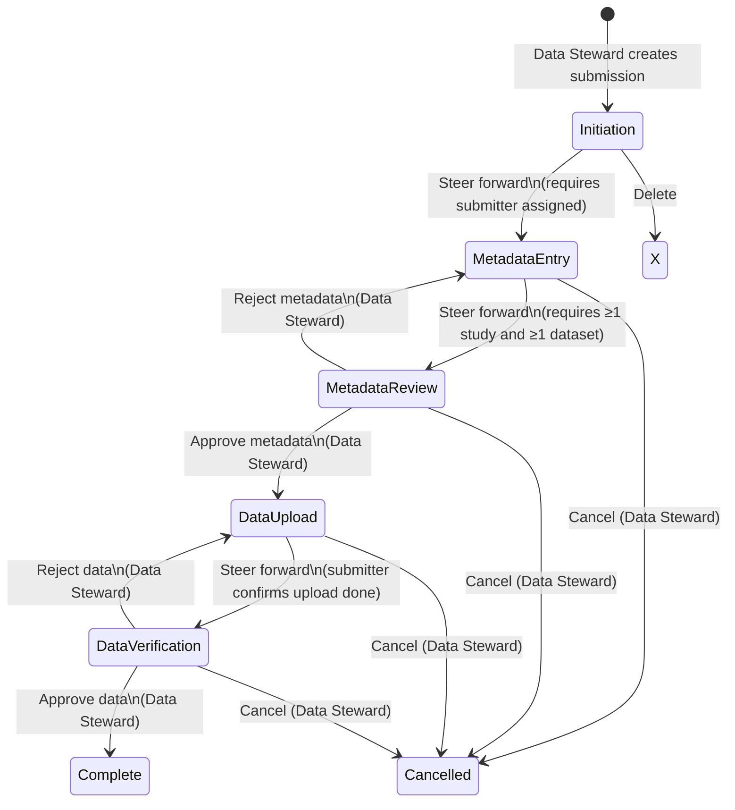

# Submission States

## State Flow Diagram

---

## State Reference

| State | Description | Who can edit metadata |
|---|---|---|
| **Initiation** | Submission created, steward assigns submitter and project | Data Steward |
| **Metadata Entry** | Submitter fills in studies, datasets, contacts, and attachments | Data Steward, Submitter |
| **Metadata Review** | Data Steward reviews and approves or rejects submitted metadata | Data Steward |
| **Data Upload** | Submitter uploads data files to the landing zone | Submitter (upload status only) |
| **Data Verification** | Data Steward verifies the uploaded data | — |
| **Complete** | Submission finalised — all data read-only | — |
| **Cancelled** | Submission terminated | — |

---

## Transitions

### Initiation → Metadata Entry
- **Who:** Data Steward or Submitter
- **Requires:** At least one submitter assigned to the submission
- **Notification:** Sent to the submitter and recipient

### Metadata Entry → Metadata Review
- **Who:** Data Steward or Submitter
- **Requires:** At least one study and at least one dataset must be present (enforced)
- **Notification:** Sent to Data Stewards

### Metadata Review → Data Upload (approve)
- **Who:** Data Steward
- **Action:** Approve metadata (optionally with a feedback message)
- **Notification:** Sent to submitter

### Metadata Review → Metadata Entry (reject)
- **Who:** Data Steward
- **Action:** Reject metadata — feedback message is required
- **Notification:** Sent to submitter

### Data Upload → Data Verification
- **Who:** Data Steward or Submitter
- **Action:** Submitter confirms data upload is complete
- **Notification:** Sent to Data Stewards

### Data Verification → Complete (approve)
- **Who:** Data Steward
- **Action:** Approve uploaded data (optionally with a feedback message)
- **Notification:** Sent to submitter

### Data Verification → Data Upload (reject)
- **Who:** Data Steward
- **Action:** Reject data — feedback message is required
- **Notification:** Sent to submitter

### Any active state → Cancelled
- **Who:** Data Steward
- **Requires:** Cancellation reason (required)
- **Active states:** Metadata Entry, Metadata Review, Data Upload, Data Verification
- **Notification:** Sent to submitter and recipient

### Revert (any state → previous state)
- **Who:** Data Steward only
- **Cannot revert** from Initiation (no previous state)

---

## Deletion

- Submissions can only be deleted while in **Initiation** state.
- Once steered forward, a submission cannot be deleted — use **Cancel** instead.
- **Who can delete:** Data Steward or Submitter (owner)
